# Grid Map

## Overview

This is a C++ library with [ROS] interface to manage two-dimensional grid maps with multiple data layers. It is designed for mobile robotic mapping to store data such as elevation, variance, color, friction coefficient, foothold quality, surface normal, traversability etc. It is used in the [Robot-Centric Elevation Mapping](https://github.com/anybotics/elevation_mapping) package designed for rough terrain navigation.

Features:

* **Multi-layered:** Developed for universal 2.5-dimensional grid mapping with support for any number of layers.
* **Efficient map re-positioning:** Data storage is implemented as two-dimensional circular buffer. This allows for non-destructive shifting of the map's position (e.g. to follow the robot) without copying data in memory.
* **Based on Eigen:** Grid map data is stored as [Eigen] data types. Users can apply available Eigen algorithms directly to the map data for versatile and efficient data manipulation.
* **Convenience functions:** Several helper methods allow for convenient and memory safe cell data access. For example, iterator functions for rectangular, circular, polygonal regions and lines are implemented.
* **ROS interface:** Grid maps can be directly converted to and from ROS message types such as PointCloud2, OccupancyGrid, GridCells, and our custom GridMap message. Conversion packages provide compatibility with [costmap_2d], [PCL], and [OctoMap] data types.
* **OpenCV interface:** Grid maps can be seamlessly converted from and to [OpenCV] image types to make use of the tools provided by [OpenCV].
* **Visualizations:** The *grid_map_rviz_plugin* renders grid maps as 3d surface plots (height maps) in [RViz]. Additionally, the *grid_map_visualization* package helps to visualize grid maps as point clouds, occupancy grids, grid cells etc.
* **Filters:** The *grid_map_filters* provides are range of filters to process grid maps as a sequence of filters. Parsing of mathematical expressions allows to flexibly setup powerful computations such as thresholding, normal vectors, smoothening, variance, inpainting, and matrix kernel convolutions.

This is research code, expect that it changes often and any fitness for a particular purpose is disclaimed.

The source code is released under a [BSD 3-Clause license](LICENSE).

**Author: Péter Fankhauser 
Affiliation: [ANYbotics](https://www.anybotics.com/) 
Maintainer: Péter Fankhauser, pfankhauser@anybotics.com **
With contributions by: Tanja Baumann, Jeff Delmerico, Remo Diethelm, Perry Franklin, Dominic Jud, Ralph Kaestner, Philipp Krüsi, Alex Millane, Daniel Stonier, Elena Stumm, Martin Wermelinger, Christos Zalidis, Edo Jelavic, Ruben Grandia, Simone Arreghini, Magnus Gärtner

This projected was initially developed at ETH Zurich (Autonomous Systems Lab & Robotic Systems Lab).

[This work is conducted as part of ANYmal Research, a community to advance legged robotics.](https://www.anymal-research.org/)

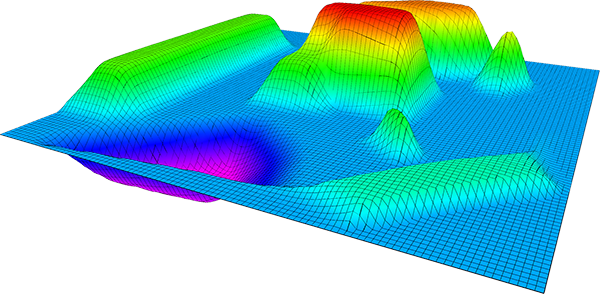

## Publications

If you use this work in an academic context, please cite the following publication:

> P. Fankhauser and M. Hutter,
> **"A Universal Grid Map Library: Implementation and Use Case for Rough Terrain Navigation"**,
> in Robot Operating System (ROS) – The Complete Reference (Volume 1), A. Koubaa (Ed.), Springer, 2016. ([PDF](http://www.researchgate.net/publication/284415855))

    @incollection{Fankhauser2016GridMapLibrary,
      author = {Fankhauser, P{\'{e}}ter and Hutter, Marco},
      booktitle = {Robot Operating System (ROS) – The Complete Reference (Volume 1)},
      title = {{A Universal Grid Map Library: Implementation and Use Case for Rough Terrain Navigation}},
      chapter = {5},
      editor = {Koubaa, Anis},
      publisher = {Springer},
      year = {2016},
      isbn = {978-3-319-26052-5},
      doi = {10.1007/978-3-319-26054-9{\_}5},
      url = {http://www.springer.com/de/book/9783319260525}
    }

## Documentation

An introduction to the grid map library including a tutorial is given in [this book chapter](http://www.researchgate.net/publication/284415855).

The C++ API is documented here:
* [grid_map_core](http://docs.ros.org/kinetic/api/grid_map_core/html/index.html)
* [grid_map_ros](http://docs.ros.org/kinetic/api/grid_map_ros/html/index.html)
* [grid_map_costmap_2d](http://docs.ros.org/kinetic/api/grid_map_costmap_2d/html/index.html)
* [grid_map_cv](http://docs.ros.org/kinetic/api/grid_map_cv/html/index.html)
* [grid_map_filters](http://docs.ros.org/kinetic/api/grid_map_filters/html/index.html)
* [grid_map_octomap](http://docs.ros.org/kinetic/api/grid_map_octomap/html/index.html)
* [grid_map_pcl](http://docs.ros.org/kinetic/api/grid_map_pcl/html/index.html)

## Installation

### Installation from Packages

To install all packages from the grid map library as Debian packages use

    sudo apt-get install ros-$ROS_DISTRO-grid-map

### Building from Source

#### Dependencies

The *grid_map_core* package depends only on the linear algebra library [Eigen].

    sudo apt-get install libeigen3-dev

The other packages depend additionally on the [ROS] standard installation (*roscpp*, *tf*, *filters*, *sensor_msgs*, *nav_msgs*, and *cv_bridge*). Other format specific conversion packages (e.g. *grid_map_cv*, *grid_map_pcl* etc.) depend on packages described below in *Packages Overview*.

#### Building

To build from source, clone the latest version from this repository into your catkin workspace and compile the package using

    cd catkin_ws/src
    git clone https://github.com/anybotics/grid_map.git
    cd ../
    catkin_make

To maximize performance, make sure to build in *Release* mode. You can specify the build type by setting

    catkin_make -DCMAKE_BUILD_TYPE=Release

### Packages Overview

This repository consists of following packages:

* ***grid_map*** is the meta-package for the grid map library.
* ***grid_map_core*** implements the algorithms of the grid map library. It provides the `GridMap` class and several helper classes such as the iterators. This package is implemented without [ROS] dependencies.
* ***grid_map_ros*** is the main package for [ROS] dependent projects using the grid map library. It provides the interfaces to convert grid maps from and to several [ROS] message types.
* ***grid_map_demos*** contains several nodes for demonstration purposes.
* ***grid_map_filters*** builds on the [ROS Filters] package to process grid maps as a sequence of filters.
* ***grid_map_msgs*** holds the [ROS] message and service definitions around the [grid_map_msg/GridMap] message type.
* ***grid_map_rviz_plugin*** is an [RViz] plugin to visualize grid maps as 3d surface plots (height maps).
* ***grid_map_visualization*** contains a node written to convert GridMap messages to other [ROS] message types for example for  visualization in [RViz].

Additional conversion packages:

* ***grid_map_costmap_2d*** provides conversions of grid maps from [costmap_2d] map types.
* ***grid_map_cv*** provides conversions of grid maps from and to [OpenCV] image types.
* ***grid_map_octomap*** provides conversions of grid maps from OctoMap ([OctoMap]) maps.
* ***grid_map_pcl*** provides conversions of grid maps from Point Cloud Library ([PCL](http://pointclouds.org/)) polygon meshes and point clouds. For details, see the grid map pcl package [README](grid_map_pcl/README.md).

### Unit Tests

Run the unit tests with

    catkin_make run_tests_grid_map_core run_tests_grid_map_ros

or

    catkin build grid_map --no-deps --verbose --catkin-make-args run_tests

if you are using [catkin tools](http://catkin-tools.readthedocs.org/).

## Usage

### Demonstrations

The *grid_map_demos* package contains several demonstration nodes. Use this code to verify your installation of the grid map packages and to get you started with your own usage of the library.

* *[simple_demo](grid_map_demos/src/simple_demo_node.cpp)* demonstrates a simple example for using the grid map library. This ROS node creates a grid map, adds data to it, and publishes it. To see the result in RViz, execute the command

        roslaunch grid_map_demos simple_demo.launch

* *[tutorial_demo](grid_map_demos/src/tutorial_demo_node.cpp)* is an extended demonstration of the library's functionalities. Launch the *tutorial_demo* with

        roslaunch grid_map_demos tutorial_demo.launch

* *[iterators_demo](grid_map_demos/src/IteratorsDemo.cpp)* showcases the usage of the grid map iterators. Launch it with

        roslaunch grid_map_demos iterators_demo.launch

* *[image_to_gridmap_demo](grid_map_demos/src/ImageToGridmapDemo.cpp)* demonstrates how to convert data from an [image](grid_map_demos/data/eth_logo.png) to a grid map. Start the demonstration with

        roslaunch grid_map_demos image_to_gridmap_demo.launch

    
    
* *[grid_map_to_image_demo](grid_map_demos/src/GridmapToImageDemo.cpp)* demonstrates how to save a grid map layer to an image. Start the demonstration with

        rosrun grid_map_demos grid_map_to_image_demo _grid_map_topic:=/grid_map _file:=/home/$USER/Desktop/grid_map_image.png

* *[opencv_demo](grid_map_demos/src/opencv_demo_node.cpp)* demonstrates map manipulations with help of [OpenCV] functions. Start the demonstration with

        roslaunch grid_map_demos opencv_demo.launch

    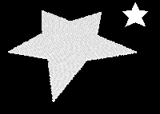

* *[resolution_change_demo](grid_map_demos/src/resolution_change_demo_node.cpp)* shows how the resolution of a grid map can be changed with help of the [OpenCV] image scaling methods. The see the results, use

        roslaunch grid_map_demos resolution_change_demo.launch

* *[filters_demo](grid_map_demos/src/FiltersDemo.cpp)* uses a chain of [ROS Filters] to process a grid map. Starting from the elevation of a terrain map, the demo uses several filters to show how to compute surface normals, use inpainting to fill holes, smoothen/blur the map, and use math expressions to detect edges, compute roughness and traversability. The filter chain setup is configured in the [`filters_demo_filter_chain.yaml`](grid_map_demos/config/filters_demo_filter_chain.yaml) file. Launch the demo with

        roslaunch grid_map_demos filters_demo.launch

    [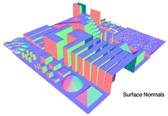](grid_map_demos/doc/filters_demo.gif)

 For more information about grid map filters, see [grid_map_filters](#grid_map_filters).

* *[interpolation_demo](grid_map_demos/src/InterpolationDemo.cpp)* shows the result of different interpolation methods on the resulting surface. The start the demo, use

        roslaunch grid_map_demos interpolation_demo.launch

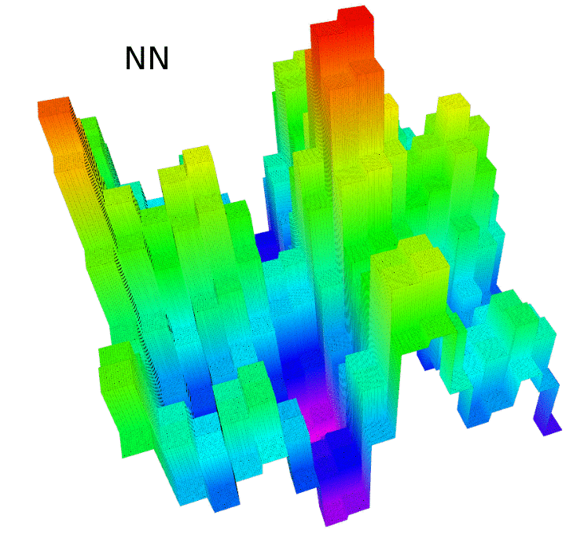
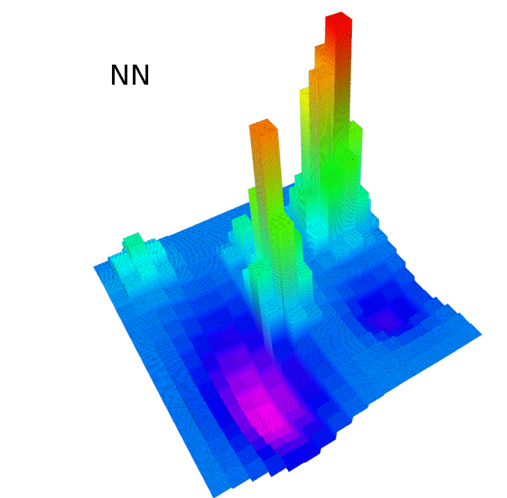

The user can play with different worlds (surfaces) and different interpolation settings in the [`interpolation_demo.yaml`](grid_map_demos/config/interpolation_demo.yaml) file. The visualization displays the ground truth in green and yellow color. The interpolation result is shown in red and purple colors. Also, the demo computes maximal and average interpolation errors, as well as the average time required for a single interpolation query.

Grid map features four different interpolation methods (in order of increasing accuracy and increasing complexity):
* **NN** - Nearest Neighbour (fastest, but least accurate).
* **Linear** - Linear interpolation.
* **Cubic convolution** - Piecewise cubic interpolation. Implemented using the cubic convolution algorithm.
* **Cubic** - Cubic interpolation (slowest, but most accurate).

For more details check the literature listed in  [`CubicInterpolation.hpp`](grid_map_core/include/grid_map_core/CubicInterpolation.hpp) file.

### Conventions & Definitions

[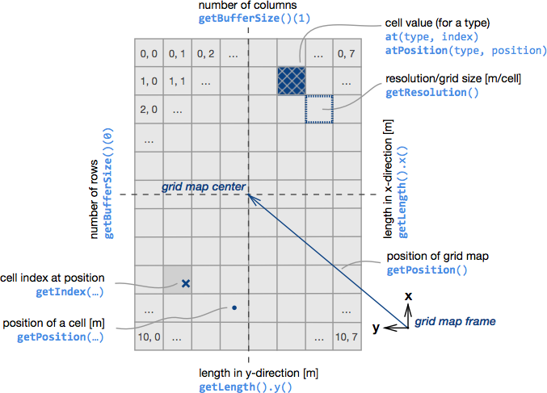](grid_map_core/doc/grid_map_conventions.pdf)

### Iterators

The grid map library contains various iterators for convenience.

Grid map | Submap | Circle | Line | Polygon
:---: | :---: | :---: | :---: | :---:
 |  |  |  | 
__Ellipse__ | __Spiral__
[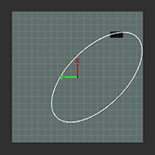](grid_map_core/doc/iterators/ellipse_iterator.gif) | [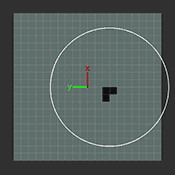](grid_map_core/doc/iterators/spiral_iterator.gif)

Using the iterator in a `for` loop is common. For example, iterate over the entire grid map with the `GridMapIterator` with

    for (grid_map::GridMapIterator iterator(map); !iterator.isPastEnd(); ++iterator) {
        cout << "The value at index " << (*iterator).transpose() << " is " << map.at("layer", *iterator) << endl;
    }

The other grid map iterators follow the same form. You can find more examples on how to use the different iterators in the *[iterators_demo](grid_map_demos/src/IteratorsDemo.cpp)* node.

Note: For maximum efficiency when using iterators, it is recommended to locally store direct access to the data layers of the grid map with `grid_map::Matrix& data = map["layer"]` outside the `for` loop:

    grid_map::Matrix& data = map["layer"];
    for (GridMapIterator iterator(map); !iterator.isPastEnd(); ++iterator) {
        const Index index(*iterator);
        cout << "The value at index " << index.transpose() << " is " << data(index(0), index(1)) << endl;
    }

You can find a benchmarking of the performance of the iterators in the `iterator_benchmark` node of the `grid_map_demos` package which can be run with

    rosrun grid_map_demos iterator_benchmark

Beware that while iterators are convenient, it is often the cleanest and most efficient to make use of the built-in [Eigen] methods. Here are some examples:

* Setting a constant value to all cells of a layer:

        map["layer"].setConstant(3.0);

* Adding two layers:

        map["sum"] = map["layer_1"] + map["layer_2"];

* Scaling a layer:

        map["layer"] = 2.0 * map["layer"];

* Max. values between two layers:

        map["max"] = map["layer_1"].cwiseMax(map["layer_2"]);

* Compute the root mean squared error:

        map.add("error", (map.get("layer_1") - map.get("layer_2")).cwiseAbs());
        unsigned int nCells = map.getSize().prod();
        double rootMeanSquaredError = sqrt((map["error"].array().pow(2).sum()) / nCells);

### Changing the Position of the Map

There are two different methods to change the position of the map:
* `setPosition(...)`: Changes the position of the map without changing data stored in the map. This changes the corresponce between the data and the map frame.
* `move(...)`: Relocates the grid map such that the corresponce between data and the map frame does not change. Data in the overlapping region before and after the position change remains stored. Data that falls outside of the map at its new position is discarded. Cells that cover previously unknown regions are emptied (set to nan). The data storage is implemented as two-dimensional circular buffer to minimize computational effort.

`setPosition(...)` | `move(...)`
:---: | :---:
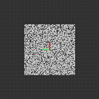 | 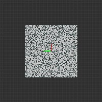|

## Packages

### grid_map_rviz_plugin

This [RViz] plugin visualizes a grid map layer as 3d surface plot (height map). A separate layer can be chosen as layer for the color information.

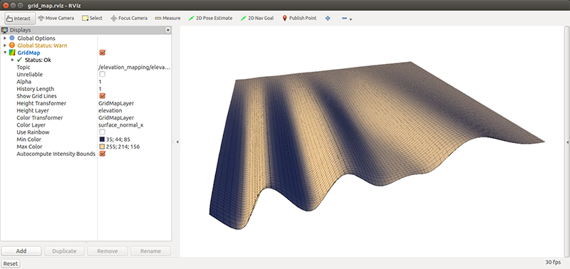

### grid_map_visualization

This node subscribes to a topic of type [grid_map_msgs/GridMap] and publishes messages that can be visualized in [RViz]. The published topics of the visualizer can be fully configure with a YAML parameter file. Any number of visualizations with different parameters can be added. An example is [here](grid_map_demos/config/tutorial_demo.yaml) for the configuration file of the *tutorial_demo*.

Point cloud | Vectors | Occupancy grid | Grid cells
--- | --- | --- | ---
 |  |  | 

#### Parameters

* **`grid_map_topic`** (string, default: "/grid_map")

    The name of the grid map topic to be visualized. See below for the description of the visualizers.

#### Subscribed Topics

* **`/grid_map`** ([grid_map_msgs/GridMap])

    The grid map to visualize.

#### Published Topics

The published topics are configured with the [YAML parameter file](grid_map_demos/config/tutorial_demo.yaml). Possible topics are:

* **`point_cloud`** ([sensor_msgs/PointCloud2])

    Shows the grid map as a point cloud. Select which layer to transform as points with the `layer` parameter.

        name: elevation
        type: point_cloud
        params:
         layer: elevation
         flat: false # optional

* **`flat_point_cloud`** ([sensor_msgs/PointCloud2])

    Shows the grid map as a "flat" point cloud, i.e. with all points at the same height *z*. This is convenient to visualize 2d maps or images (or even video streams) in [RViz] with help of its `Color Transformer`. The parameter `height` determines the desired *z*-position of the flat point cloud.

        name: flat_grid
        type: flat_point_cloud
        params:
         height: 0.0

    Note: In order to omit points in the flat point cloud from empty/invalid cells, specify the layers which should be checked for validity with `setBasicLayers(...)`.

* **`vectors`** ([visualization_msgs/Marker])

    Visualizes vector data of the grid map as visual markers. Specify the layers which hold the *x*-, *y*-, and *z*-components of the vectors with the `layer_prefix` parameter. The parameter `position_layer` defines the layer to be used as start point of the vectors.

        name: surface_normals
        type: vectors
        params:
         layer_prefix: normal_
         position_layer: elevation
         scale: 0.06
         line_width: 0.005
         color: 15600153 # red

* **`occupancy_grid`** ([nav_msgs/OccupancyGrid])

    Visualizes a layer of the grid map as occupancy grid. Specify the layer to be visualized with the `layer` parameter, and the upper and lower bound with `data_min` and `data_max`.

        name: traversability_grid
        type: occupancy_grid
        params:
         layer: traversability
         data_min: -0.15
         data_max: 0.15

* **`grid_cells`** ([nav_msgs/GridCells])

    Visualizes a layer of the grid map as grid cells. Specify the layer to be visualized with the `layer` parameter, and the upper and lower bounds with `lower_threshold` and `upper_threshold`.

        name: elevation_cells
        type: grid_cells
        params:
         layer: elevation
         lower_threshold: -0.08 # optional, default: -inf
         upper_threshold: 0.08 # optional, default: inf

* **`region`** ([visualization_msgs/Marker])

    Shows the boundary of the grid map.

        name: map_region
        type: map_region
        params:
         color: 3289650
         line_width: 0.003

*Note: Color values are in RGB form as concatenated integers (for each channel value 0-255). The values can be generated like [this](http://www.wolframalpha.com/input/?i=BitOr%5BBitShiftLeft%5Br%2C16%5D%2C+BitShiftLeft%5Bg%2C8%5D%2C+b%5D+where+%7Br%3D0%2C+g%3D255%2C+b%3D0%7D) as an example for the color green (red: 0, green: 255, blue: 0).*

### grid_map_filters

The *grid_map_filters* package containts several filters which can be applied a grid map to perform computations on the data in the layers. The grid map filters are based on [ROS Filters], which means that a chain of filters can be configured as a YAML file. Furthermore, additional filters can be written and made available through the ROS plugin mechanism, such as the [`InpaintFilter`](grid_map_cv/include/grid_map_cv/InpaintFilter.hpp) from the `grid_map_cv` package.

Several basic filters are provided in the *grid_map_filters* package:

* **`gridMapFilters/ThresholdFilter`**

    Set values below/above a threshold to a specified value.

        name: lower_threshold
        type: gridMapFilters/ThresholdFilter
        params:
          layer: layer_name
          lower_threshold: 0.0 # alternative: upper_threshold
          set_to: 0.0 # # Other uses: .nan, .inf

* **`gridMapFilters/MeanInRadiusFilter`**

    Compute for each cell of a layer the mean value inside a radius.

        name: mean_in_radius
        type: gridMapFilters/MeanInRadiusFilter
        params:
          input_layer: input
          output_layer: output
          radius: 0.06 # in m.
* **`gridMapFilters/MedianFillFilter`**

    Compute for each _NaN_ cell of a layer the median (of finites) inside a patch with radius. 
    Optionally, apply median calculations for values that are already finite, the patch radius for these points is given by existing_value_radius. 

        name: median
        type: gridMapFilters/MedianFillFilter
        params:
          input_layer: input
          output_layer: output
          fill_hole_radius: 0.11 # in m. 
          filter_existing_values: false # Default is false. If enabled it also does a median computation for existing values. 
          existing_value_radius: 0.2 # in m. Note that this option only has an effect if filter_existing_values is set true. 
    
* **`gridMapFilters/NormalVectorsFilter`**

    Compute the normal vectors of a layer in a map.

        name: surface_normals
        type: gridMapFilters/NormalVectorsFilter
        params:
          input_layer: input
          output_layers_prefix: normal_vectors_
          radius: 0.05
          normal_vector_positive_axis: z

* **`gridMapFilters/NormalColorMapFilter`**

    Compute a new color layer based on normal vectors layers.

        name: surface_normals
        type: gridMapFilters/NormalColorMapFilter
        params:
          input_layers_prefix: normal_vectors_
          output_layer: normal_color

* **`gridMapFilters/MathExpressionFilter`**

    Parse and evaluate a mathematical matrix expression with layers of a grid map. See [EigenLab] for the documentation of the expressions.

        name: math_expression
        type: gridMapFilters/MathExpressionFilter
        params:
          output_layer: output
          expression: acos(normal_vectors_z) # Slope.
          # expression: abs(elevation - elevation_smooth) # Surface roughness.
          # expression: 0.5 * (1.0 - (slope / 0.6)) + 0.5 * (1.0 - (roughness / 0.1)) # Weighted and normalized sum.

* **`gridMapFilters/SlidingWindowMathExpressionFilter`**

    Parse and evaluate a mathematical matrix expression within a sliding window on a layer of a grid map. See [EigenLab] for the documentation of the expressions.

        name: math_expression
        type: gridMapFilters/SlidingWindowMathExpressionFilter
        params:
          input_layer: input
          output_layer: output
          expression: meanOfFinites(input) # Box blur
          # expression: sqrt(sumOfFinites(square(input - meanOfFinites(input))) ./ numberOfFinites(input)) # Standard deviation
          # expression: 'sumOfFinites([0,-1,0;-1,5,-1;0,-1,0].*elevation_inpainted)' # Sharpen with kernel matrix
          compute_empty_cells: true
          edge_handling: crop # options: inside, crop, empty, mean
          window_size: 5 # in number of cells (optional, default: 3), make sure to make this compatible with the kernel matrix
          # window_length: 0.05 # instead of window_size, in m

* **`gridMapFilters/DuplicationFilter`**

    Duplicate a layer of a grid map.

        name: duplicate
        type: gridMapFilters/DuplicationFilter
        params:
          input_layer: input
          output_layer: output

* **`gridMapFilters/DeletionFilter`**

    Delete layers from a grid map.

        name: delete
        type: gridMapFilters/DeletionFilter
        params:
          layers: [color, score] # List of layers.

Additionally, the *grid_map_cv* package provides the following filters:

* **`gridMapCv/InpaintFilter`**

    Use OpenCV to inpaint/fill holes in a layer.

        name: inpaint
        type: gridMapCv/InpaintFilter
        params:
          input_layer: input
          output_layer: output
          radius: 0.05 # in m

## Build Status

### Devel Job Status

| | Indigo | Kinetic | Lunar | Melodic |
| --- | --- | --- | --- | --- |
| grid_map |  |  |  |  |
| doc |  |  |  |  |

### Release Job Status

| | Indigo | Kinetic | Lunar | Melodic |
| --- | --- | --- | --- | --- |
| grid_map |  |  |  |  |
| grid_map_core |  |  |  |  |
| grid_map_costmap_2d |  |  |  |  |
| grid_map_cv |  |  |  |  |
| grid_map_demos |  |  |  |  |
| grid_map_filters |  |  |  |  |
| grid_map_loader |  |  |  |  |
| grid_map_msgs |  |  |  |  |
| grid_map_octomap |  |  |  |  |
| grid_map_pcl |  |  |  |  |
| grid_map_ros |  |  |  |  |
| grid_map_rviz_plugin |  |  |  |  |
| grid_map_sdf |  |  |  |  |
| grid_map_visualization |  |  |  |  |

## Bugs & Feature Requests

Please report bugs and request features using the [Issue Tracker](https://github.com/anybotics/grid_map/issues).

[ROS]: http://www.ros.org
[RViz]: http://wiki.ros.org/rviz
[Eigen]: http://eigen.tuxfamily.org
[OpenCV]: http://opencv.org/
[OctoMap]: https://octomap.github.io/
[PCL]: http://pointclouds.org/
[costmap_2d]: http://wiki.ros.org/costmap_2d
[grid_map_msgs/GridMapInfo]: http://docs.ros.org/api/grid_map_msgs/html/msg/GridMapInfo.html
[grid_map_msgs/GridMap]: http://docs.ros.org/api/grid_map_msgs/html/msg/GridMap.html
[grid_map_msgs/GetGridMap]: http://docs.ros.org/api/grid_map_msgs/html/srv/GetGridMap.html
[sensor_msgs/PointCloud2]: http://docs.ros.org/api/sensor_msgs/html/msg/PointCloud2.html
[visualization_msgs/Marker]: http://docs.ros.org/api/visualization_msgs/html/msg/Marker.html
[geometry_msgs/PolygonStamped]: http://docs.ros.org/api/geometry_msgs/html/msg/PolygonStamped.html
[nav_msgs/OccupancyGrid]: http://docs.ros.org/api/nav_msgs/html/msg/OccupancyGrid.html
[nav_msgs/GridCells]: http://docs.ros.org/api/nav_msgs/html/msg/GridCells.html
[ROS Filters]: http://wiki.ros.org/filters
[EigenLab]: https://github.com/leggedrobotics/EigenLab
