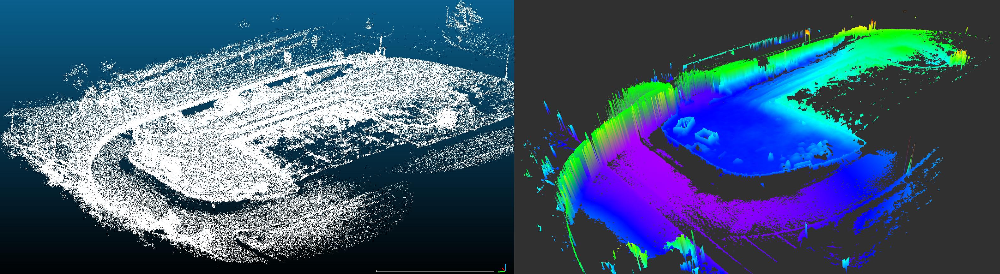
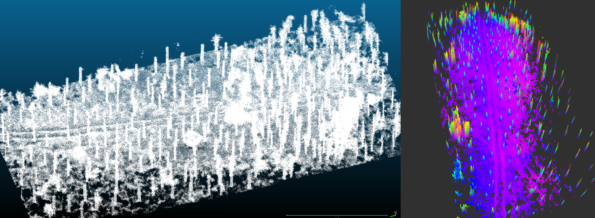
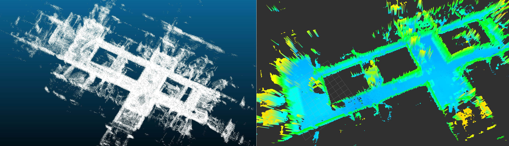

# Grid Map Pcl

## Overview

This is a C++ package integrated with ROS for computing 2.5D elevation maps from pcl types. Currently, supported types are point clouds and meshes.

#### Converting a mesh to a grid map
The elevation is computed by raytracing lines coming from the grid map cells and computing their intersection with the mesh.

#### Converting a raw pointcloud to a grid map
The elevation is computed by slicing the point cloud in the x-y plane into columns. Column location and size correspond to the location and size of grid map cells in the point cloud coordinate frame. Subsequently, the clustering of points inside each column is performed and the elevation of the lowest cluster (min z coordinate) is assumed to be the terrain elevation. The elevation of the cluster is computed as a mean of all positions from the points that belong to a cluster. All calculations are performed in the pointcloud frame.

**Authors: Edo Jelavic, Dominic Jud 
Affiliation: [ETH Zurich, Robotics Systems Lab](https://rsl.ethz.ch/) **

## Examples

Examples of elevation maps computed from point clouds using this package:

#### Outdoor dataset example

#### Forest dataset example

#### Indoor dataset example

## Usage

The algorithm will open the .pcd file, convert the point cloud to a grid map and save the grid map as a rosbag into the folder specified by the user.

1.  Place .pcd files in the package folder or anywhere on the system (e.g. grid_map_pcl/data/example.pcd).
2.  Modify the *folder_path* inside the launch file such that the folder file points to the folder containing .pcd files (e.g. /*"path to the grid_map_pcl folder"*/data).
3.  Change the *pcd_filename* to the point cloud file that you want to process
4.  You can run the algorithm with: *roslaunch grid_map_pcl grid_map_pcl_loader_node.launch* 
5.  Once the algorithm is done you will see the output in the console, then you can run rviz in a separate terminal (make sure that you have sourced your workspace, **DO NOT CLOSE** the terminal where *grid_map_pcl_loader_node* is running ) and visualize the resulting grid map. Instructions on how to visualize a grid map are in the grid map [README](../README.md).

The resulting grid map will be saved in the folder given by *folder_path* variable in the launch file and will be named with a string contained inside the *output_grid_map* variable. For large point clouds (100M-140M points) the algorithm takes about 30-60 min to finish (with 6 threads). For sizes that are in the range of 40M to 60M points, the runtime varies between 5 and 15 min, depending on the number of points. Point cloud with around 10M points or less can be processed in a minute or two.

## Parameters

### Algorithm Parameters (conversion from raw point clouds)

##### General parameters
* **pcl_grid_map_extraction/num_processing_threads** Number of threads for processing grid map cells. Filtering of the raw input point cloud is not parallelized.

##### Grid map parameters
Resulting grid map parameters.
* **pcl_grid_map_extraction/grid_map/min_num_points_per_cell** Minimum number of points in the point cloud that have to fall within any of the grid map cells. Otherwise the cell elevation will be set to NaN.
* **pcl_grid_map_extraction/grid_map/resolution** Resolution of the grid map. Width and lengts are computed automatically.

### Point Cloud Pre-processing Parameters

##### Rigid body transform parameters

Rigid body transorm that is applied to the point cloud before computing elevation.
* **pcl_grid_map_extraction/cloud_transform/translation** Translation (xyz) that is applied to the input point cloud before computing elevation.
* **pcl_grid_map_extraction/cloud_transform/rotation** Rotation (intrinsic rotation, convention X-Y'-Z'') that is applied to the input point cloud before computing elevation.

##### Cluster extraction parameters
Cluster extraction is based on pcl algorithms. See: http://pointclouds.org/documentation/tutorials/cluster_extraction.php for more details.
* **pcl_grid_map_extraction/cluster_extraction/cluster_tolerance** Distance between points below which they will still be considered part of one cluster. 
* **pcl_grid_map_extraction/cluster_extraction/min_num_points** Min number of points that a cluster needs to have (otherwise it will be discarded). 
* **pcl_grid_map_extraction/cluster_extraction/max_num_points** Max number of points that a cluster can have (otherwise it will be discarded). 

##### Outlier removal parameters
See http://pointclouds.org/documentation/tutorials/statistical_outlier.php for more explanation on outlier removal.
* **pcl_grid_map_extraction/outlier_removal/is_remove_outliers*** Whether to perform statisctical outlier removal.
* **pcl_grid_map_extraction/outlier_removal/mean_K*** Number of neighbours to analyze for estimating statistics of a point.
* **pcl_grid_map_extraction/outlier_removal/stddev_threshold*** Number of standard deviations under which points are considered to be inliers.

##### Subsampling parameters
See http://pointclouds.org/documentation/tutorials/voxel_grid.php for more explanation on point cloud downsampling
* **pcl_grid_map_extraction/downsampling/is_downsample_cloud** Whether to perform downsampling or not.
* **pcl_grid_map_extraction/downsampling/voxel_size** Voxel sizes (xyz) in meters.

